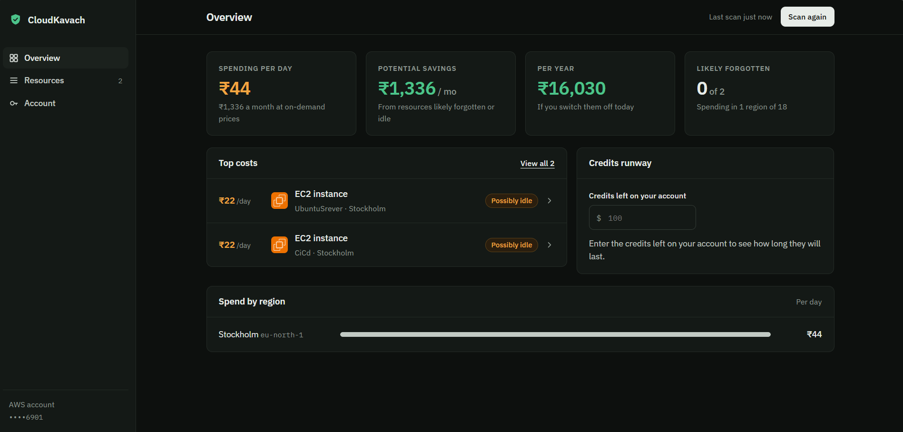
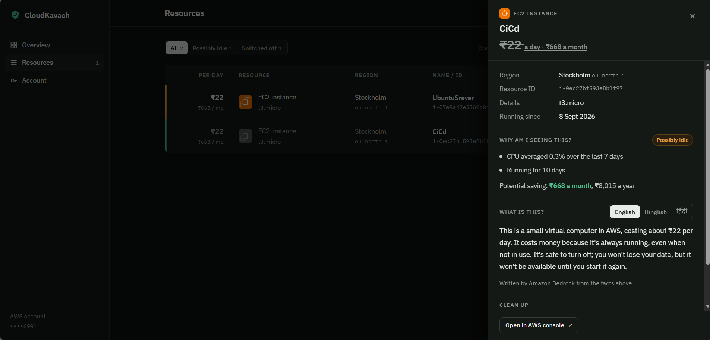
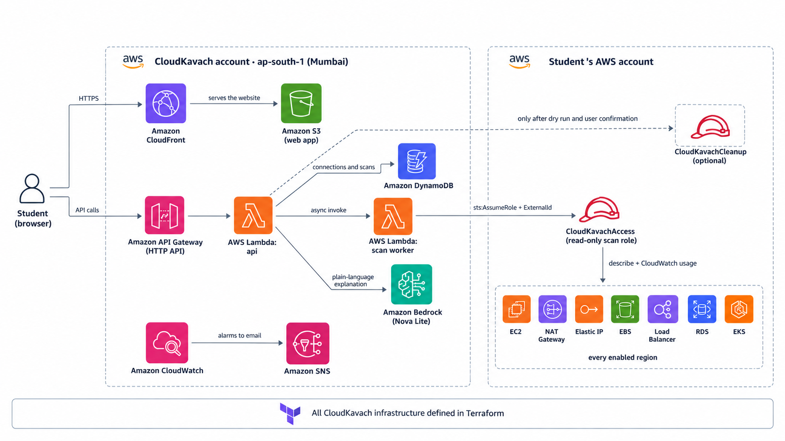
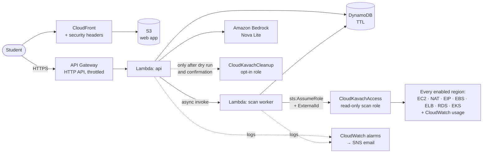

<h1 align="center">CloudKavach</h1>

<p align="center"><b>Find the AWS resources quietly billing you, in every region, and switch them off safely.</b></p>

<p align="center">
  <a href="https://d8uec0cg538xi.cloudfront.net"><b>Live app</b></a> ·
  <a href="#demo">Demo video</a> ·
  <a href="#architecture">Architecture</a> ·
  <a href="#run-it-yourself">Run it yourself</a>
</p>

<p align="center">
  
  
  
  
</p>



Built for the WeMakeDevs × AWS **First Commit** hackathon (Bharat Builds Tour, Sept 17–20, 2026), Ship It track.

---

## The problem

A student creates an EC2 instance, a NAT Gateway or an RDS database for a project, then forgets it in a region they never open again. The bill arrives weeks later, and nothing in the console warned them in time.

This happened to me. My account had used **$57 of its $120 free credits**. CloudKavach's first scan found the biggest reason: a server in Stockholm (`eu-north-1`) that had been running for **161 days at 0.2% CPU**, about $40 of it on its own.

AWS has cost tools, but none answers the beginner's question: *what is running in my account right now, and what is it costing me?*

- **AWS Budgets** alerts after the money is spent and doesn't say which resource caused it.
- **Compute Optimizer** flags idle resources only after 14–32 days of usage data.
- **Trusted Advisor** cost checks need a paid Business Support plan.

## What it does

Think of it as a calculator for your AWS bill.

| | |
|---|---|
| **Input** | Read-only access to an AWS account, and one click on **Scan** |
| **Process** | For every enabled region × 7 resource types: find what is running, price it, and check whether it is actually being used |
| **Output** | Each billable resource with its cost per day and month in rupees, a verdict with evidence, potential savings per month and year, and how long your credits will last |

A real result from my own account:

```
UbuntuSrever · EC2 t3.micro · Stockholm (eu-north-1)
  ₹22 a day · ₹668 a month                                  Possibly idle
  · CPU averaged 0.2% over the last 7 days
  · Running for 161 days

Potential savings: ₹1,336 a month · ₹16,030 a year
```

**Existing isn't the same as wasted.** A busy server is meant to be running, so every finding gets a verdict from its CloudWatch usage, attachment state, age, and whether it is the only thing billing in its region:

| Verdict | Meaning | Counts as a saving? |
|---|---|---|
| **Likely forgotten** | No traffic, no connections, or attached to nothing | Yes |
| **Possibly idle** | Running, but barely used | Yes |
| **In use** | Usage shows it is doing real work | No |
| **Not sure** | No usage data available | No |

Then, for each finding:

- **Explain.** Amazon Bedrock describes it in **English, Hinglish or Hindi**: what it is, why it costs money while idle, and whether turning it off is safe. The model is given the facts, including what each action really does, so it doesn't guess.
- **Clean up.** A dry run checks permissions first. Only after you confirm does CloudKavach stop the instance, release the IP, delete the NAT Gateway or stop the database. Anything that could destroy data, such as an EBS volume, is never automated.

**What it checks:** running EC2 instances, NAT Gateways, idle Elastic IPs, unattached EBS volumes, load balancers, RDS databases and EKS clusters.

## Demo

- **Live app:** https://d8uec0cg538xi.cloudfront.net
- **Video (3 min):** _added after recording_



## Architecture



<details>
<summary>The same diagram as code (Mermaid)</summary>



</details>

**What happens on a scan**

1. **Connect.** The web app asks the API for a connection. The API generates a random ExternalId and returns a one-click CloudFormation link. The student launches it in their own account. It creates the read-only `CloudKavachAccess` role, and a separate `CloudKavachCleanup` role only if they set `AllowCleanup=true`. They paste back the scan role's ARN and CloudKavach verifies it can assume it.
2. **Scan.** `POST /scans` records the scan as *running* in DynamoDB, invokes the worker Lambda asynchronously and returns straight away.
3. **Worker.** Assumes the scan role, lists enabled regions, and runs every region × check in parallel. Each finding is priced, checked against CloudWatch usage, and given a verdict with reasons. The report is saved to DynamoDB.
4. **Results.** The web app polls `GET /scans/{id}` every two seconds and shows the report when it's ready.
5. **Cleanup (optional).** Only this step assumes the cleanup role. If it doesn't exist, cleanup is refused and nothing else is affected.

## Why it's built this way

| Decision | Why |
|---|---|
| **Scan runs in an async worker** | 18 regions can take longer than API Gateway's 30-second limit, so the API hands off and the UI polls. |
| **Two roles, not one** | The scan role allows exactly the nine read calls the scanner makes, so "read-only" is literally true. Cleanup uses a separate role with four actions that exists only if the student opts in. |
| **Cross-account role + ExternalId** | The pattern commercial cloud tools use. The ExternalId stops anyone else from using the role by impersonating CloudKavach (the "confused deputy" problem). |
| **Verdicts from rules, not AI** | Verdicts come from fixed, testable rules over usage, attachment and age, and every verdict shows its evidence. Bedrock only writes the explanation. It never decides what to switch off. |
| **Server-side lookup for actions** | Explain and cleanup requests carry only an ID. Resource details come from CloudKavach's own scan record, never from the browser. |
| **Dry run by default** | EC2's `DryRun` flag checks permissions without changing anything. Real changes need an explicit confirmation. |
| **One boto3 session, many clients** | boto3 sessions aren't thread-safe, but clients are. Building the clients once and running checks in parallel took a local scan from 43 s to about 20 s. |
| **Graceful fallback** | If Bedrock is unavailable, a built-in explanation is shown and everything else keeps working. |
| **DynamoDB single table with TTL** | A connection and its scans share a partition key. Scans delete themselves after 7 days. |
| **Cost guardrails** | Pay-per-request everywhere, Graviton Lambdas, API throttling, 14-day log retention, and a monthly AWS Budget (credits excluded) defined in Terraform. |
| **Observability** | Structured JSON logs, log metric filters for failed scans and unhandled errors, and CloudWatch alarms that email the owner. |

## Security

| | Scan role `CloudKavachAccess` | Cleanup role `CloudKavachCleanup` |
|---|---|---|
| **Created** | Always | Only if you set `AllowCleanup=true` |
| **Can** | List resources and read usage metrics (9 read-only actions) | Stop instances, release idle IPs, delete NAT Gateways, stop databases |
| **Used by** | The scan worker | Only the cleanup endpoint, after a dry run and your confirmation |

**Neither role can** read your S3 files, read what's inside your databases, see secrets, delete anything that holds data, or keep any access after you delete the stack.

Also:

- No sign-up, email or password. A connection is identified by a random secret held only in the student's browser.
- Resource names from AWS tags are escaped before display, so a malicious tag can't inject script into the page.
- The web bucket is private and readable only by CloudFront (Origin Access Control). The only public object is the access-role template, because CloudFormation has to fetch it.
- CloudFront adds HSTS, `X-Frame-Options` and `X-Content-Type-Options` headers.

## Tech stack

| Layer | Service | Why |
|---|---|---|
| Web app | Amazon S3 + CloudFront | Static site with no servers, HTTPS and security headers |
| API | Amazon API Gateway (HTTP API) | Cheap, throttled, CORS handled at the edge |
| Compute | AWS Lambda (Python 3.12, arm64) | Pay per request; a separate worker for long scans |
| Data | Amazon DynamoDB | On-demand, TTL, point-in-time recovery |
| AI | Amazon Bedrock (Nova Lite, APAC inference profile) | Low-cost explanations in Indian languages, kept in the APAC region |
| Access | AWS IAM + CloudFormation | Cross-account roles the student creates and controls |
| Monitoring | Amazon CloudWatch + SNS + AWS Budgets | Alarms, log metrics and a cost guardrail |
| Infrastructure | Terraform | Every resource above is code |

## Run it yourself

**Scan your own account from the terminal (read-only):**

```bash
cd backend
pip install -r requirements-dev.txt
python cli.py        # uses your current AWS credentials
python -m pytest     # 18 unit tests
```

**Preview the web app with sample data:**

```bash
cd frontend
python -m http.server 5500     # open http://127.0.0.1:5500
```

**Deploy the whole stack:**

```bash
cd infra
cp example.tfvars terraform.tfvars   # set alert_email
terraform init
terraform plan -out=tfplan
terraform apply tfplan
```

`terraform apply` prints `website_url`. With no traffic the stack costs well under a dollar a month, mostly the four CloudWatch alarms.

## Project structure

```
backend/
  cloudkavach/        Deployed to Lambda
    scanner.py        Finds billable resources in every region
    assess.py         Verdicts from usage, attachment and age, with reasons
    pricing.py        Approximate on-demand prices
    explain.py        Bedrock explanations with a built-in fallback
    cleanup.py        Dry-run-first, allowlisted cleanup actions
    handlers.py       API routes and the scan worker
    store.py          DynamoDB access
  cli.py              Local only: scan your own account from the terminal
  tests/              Local and CI only: unit tests
frontend/             Static web app (HTML, CSS, JavaScript, official AWS icons; no build step)
infra/                Terraform for everything, plus the access-role CloudFormation template
docs/screenshots/     Screenshots used in this README
```

Only `backend/cloudkavach/*.py` goes into the Lambda package. The CLI and tests never leave your machine.

## What's next

- More checks that catch students: SageMaker endpoints and notebooks, OpenSearch domains, ElastiCache, VPC interface endpoints
- A weekly scheduled scan that emails you when something new starts billing
- GitHub Actions CI with OIDC (tests, `terraform validate` and `plan` on every pull request)
- Sign-in with Amazon Cognito so a connection works across devices

## What I learned

<!-- Rewrite these in your own words before submitting; judges score this section. -->
- API Gateway's 30-second limit shaped the architecture: long work belongs in an async worker.
- How cross-account access works in practice: `sts:AssumeRole`, ExternalId and trust policies, and why scan and cleanup deserve separate roles.
- A resource existing is not the same as it being wasted; usage data turns a list into a judgement you can defend.
- boto3 sessions are not thread-safe, but clients are, and building them once matters for speed.
- EC2 answers a permitted dry run with a `DryRunOperation` error, not a success.
- An LLM explains more accurately when it is given facts than when it is left to guess from a resource name.

## AI tools used

- **Amazon Bedrock** (Nova Lite) is part of the product itself, for explanations.

## Credits

- **AWS Architecture Icons** from [aws.amazon.com/architecture/icons](https://aws.amazon.com/architecture/icons/), used to represent AWS services as AWS permits customers to.
- **IBM Plex Sans, Plex Sans Devanagari and Plex Mono** fonts, via Google Fonts, under the SIL Open Font License 1.1.
- **GitHub mark** from [Octicons](https://github.com/primer/octicons), MIT License.

AWS, Amazon Bedrock and the other AWS service names are trademarks of Amazon.com, Inc. or its affiliates. CloudKavach is an independent project.
